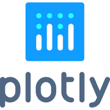

  

###

  

###

  

###

<h1 align="center">Dashboard de Vendas com Python</h1>

###

<h2 align="left">Streamlit: construindo um dashboard interativo</h3>

###

Curso desenvolvido juntamente com os professores da Alura para colocar em prática conhecimentos importantes para Ciência e Análise de Dados: extração, manipulação e apresentação de dados. Utilizando uma API de teste do curso da Alura, utilizamos as bibliotecas Python para porduzir um dashboard para um sistema comercial de vendas.

###

<h3 align="left">Extração de Dados</h3>

A capacidade de extrair dados de maneira eficiente de fontes diversas é fundamental para qualquer cientista de dados. Neste projeto, utilizamos a biblioteca <strong>requests</strong> para adquirir dados através de uma API. Este processo é essencial pois, em ambientes profissionais, grande parte dos dados necessários para análises reside em servidores remotos e é acessível somente via APIs.

###

<h3 align="left">Manipulação de Dados</h3>

Após a extração, os dados raramente estão prontos para análises subsequentes. Eles podem estar incompletos, desorganizados ou em formatos não ideais. A habilidade de limpar, transformar e reestruturar esses dados é crucial. Usamos <strong>pandas</strong>, uma das bibliotecas mais populares e poderosas em Python para manipulação de dados, para preparar nossos dados, um passo crítico antes de qualquer análise ou visualização.

###

<h3 align="left">Apresentação de Dados</h3>

A etapa final, mas não menos importante, é a capacidade de apresentar dados de maneira compreensível. Independentemente de quão avançadas sejam as análises, se os insights não forem comunicados de forma eficaz, as partes interessadas podem não compreendê-los ou utilizá-los. Utilizando <strong>Streamlit</strong> e <strong>Plotly</strong>, criamos visualizações interativas e intuitivas, permitindo uma exploração aprofundada e uma compreensão mais clara dos dados.

###

<h3 align="left">Conclusão</h3>

Este projeto simboliza a jornada de um cientista de dados através da coleta, limpeza, manipulação e apresentação de dados de maneira que não apenas facilite a compreensão dos insights derivados dos dados, mas também permita que os usuários interajam e obtenham uma compreensão mais profunda das análises apresentadas. A habilidade de construir uma ponte entre dados brutos e tomadas de decisão informadas por meio de visualizações é uma competência valiosa em qualquer indústria, reforçando a necessidade de cientistas de dados competentes e proficientes.

###

Link do Dashboard: <a href="https://dashboard-vendas-alura.streamlit.app/">Dashboard de Vendas</a>

<h3 align="left">📚 Bibliotecas utilizadas :</h3>
<ul>
    <li><a href="https://requests.readthedocs.io/en/latest/">Requests</li></a>
    <li><a href="https://pandas.pydata.org/">pandas</a></li>
    <li><a href="https://plotly.com/python/plotly-express/">Plotly Express</a></li>
    <li><a href="https://streamlit.io/">Streamlit</a></li>
</ul>

<h3 align="left">🛠 Language and tools</h3>

###

  
  
  
  
  
  
  
  
  
  
  

###

<h3 align="left">🔥   My Stats :</h3>

###

  

###
